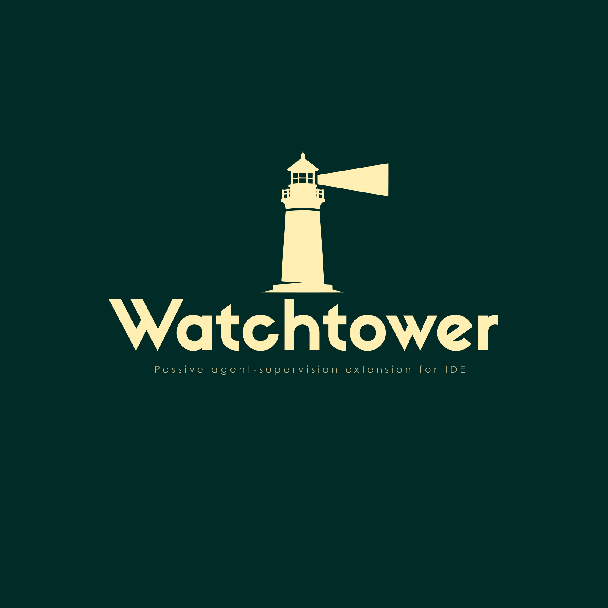

<div align="center">
  
  <h1>Watchtower</h1>
  <p><b>Passive agent-supervision extension for Antigravity (VS Code-based IDE).</b></p>
  
  <p>
    <a href="https://github.com/Mrun25/WatchTower/actions"></a>
    <a href="https://marketplace.visualstudio.com/items?itemName=watchtower-dev.watchtower"></a>
    <a href="https://github.com/Mrun25/WatchTower/blob/main/LICENSE"></a>
  </p>
</div>

---

## 📖 Overview

AI coding agents inside IDEs make broad, multi-file edits from short, vague prompts — and can silently break relationships between files the agent isn't tracking (e.g., resizing a frontend button accidentally desyncs the backend route it calls). 

**Watchtower** passively builds and maintains a JSON map of how your codebase's files and functions connect (within a language and across languages) alongside a running change log. It uses this shared foundation to power four core capabilities.

---

## ✨ Features

1. **Passive Connection-Break Detection** (`Alt+A`) — Flags when a change breaks a tracked cross-file relationship.
2. **Change Logging Over Time** — Records what changed, where, and whether it was reverted or repeated ("thrash").
3. **Prompt Refinement** (`Alt+P`) — Rewrites a vague prompt into an explicit one, grounded in the map + log. Output via a pseudo-terminal and auto-copied to your clipboard to paste into Antigravity.
4. **Context-Aware Chat** (`Alt+C`) — Answers questions about the codebase grounded in real project structure and history, not generic explanation.

### 🎥 Product Demo

*(Placeholder for Screen Recording/Demo)*

https://github.com/Mrun25/WatchTower/raw/main/assets/Watchtower-video.mp4

A small circular HUD shows passive-watch status at a glance (Off / Scanning / Watching / Flagged).

> **Note**: Mistral (cloud API) is used **only** as a reasoning layer on top of this data — refining prompts, answering questions, explaining flags. It never edits the relationship map or the codebase; map-building stays mechanical and deterministic.

---

## 🛠 Repository Architecture

```text
watchtower/
├── package.json              VS Code extension manifest (commands, keybindings, settings)
├── README.md                 This file
├── assets/                   Static assets including logos and demo GIFs
├── src/
│   ├── extension.js          Entry point — wires Alt+A / Alt+P / Alt+C + HUD together
│   ├── core/                 Shared file names, HUD states, storage and watcher
│   ├── parsers/              Plugin architecture + JS/Python parsers
│   ├── matcher/              Language-agnostic route/string cross-language bridge
│   ├── map/                  Full scan + incremental update
│   ├── log/                  Change recording, revert detection, thrash detection
│   ├── detection/            Connection break detection logic
│   ├── hud/                  Circular status webview (Off/Scanning/Watching/Flagged)
│   ├── prompt/               Context-scoping for Alt+P
│   ├── chat/                 Context-retrieval for Alt+C
│   └── mistral/              Cloud API wrapper (advisory-only)
├── test/                     Zero-dependency assertion test suite (43 checks)
├── test-fixtures/            Small JS+Python fixture project used by tests
└── archive/                  Contains older files like the phase0-spike
```

For more detailed diagrams on how Watchtower works under the hood, see [ARCHITECTURE.md](docs/ARCHITECTURE.md).

---

## 🚀 Installation (Antigravity / VS Code)

Watchtower has zero npm dependencies, so there's no `npm install` step.

1. Copy (or symlink) the `watchtower/` folder into your extensions directory:
   - macOS/Linux: `~/.vscode/extensions/watchtower-dev.watchtower-0.1.0`
   - *Antigravity should follow the same VS Code extensions convention.*
2. Reload the IDE window.
3. Run **Watchtower: Set Mistral API Key** from the command palette and paste in your Mistral cloud API key.
4. Open a project folder and press **Alt+A**. The HUD should appear and enter "Scanning," then settle into "Watching" once the first scan completes.

---

## ⌨️ Keybindings

| Key | Action |
| --- | --- |
| `Alt+A` | First press: one-time scan + build relationship map. Later presses: toggle passive watching on/off. |
| `Alt+P` | Select a rough prompt or code, then press to get a refined prompt (copied to clipboard). Requires Alt+A to have run at least once. |
| `Alt+C` | Open the context-aware chat prompt box. |

---

## ⚙️ Configuration Settings

- `watchtower.mistralModel` — Mistral model name (default `mistral-large-latest`).
- `watchtower.flagThreshold` — `strict` / `balanced` (default) / `lenient` — how aggressively connection breaks are flagged.
- `watchtower.maxLogEntriesInPromptContext` — caps how much change-log history is pulled into Alt+P / Alt+C context to avoid token-wasteful over-stuffing.

---

## 🧪 Testing

No install step needed — the extension has zero runtime dependencies outside the Node/VS Code standard library.

```bash
node test/runTests.js
```

Runs 43 checks including JS/Python parser testing, cross-language route matcher, HUD rendering, prompt context scoping, and connection-break detection.
