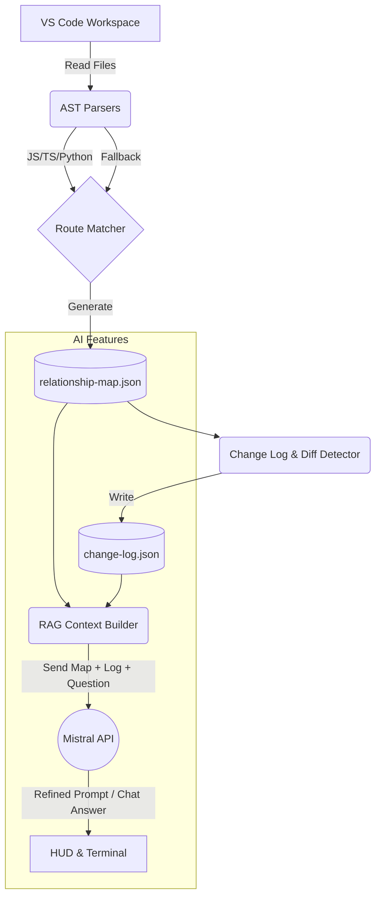
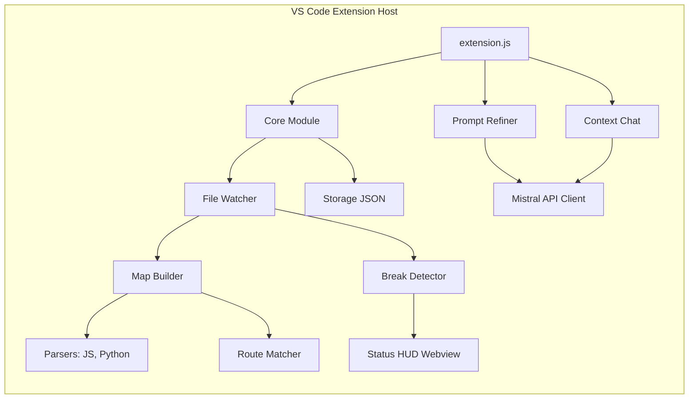
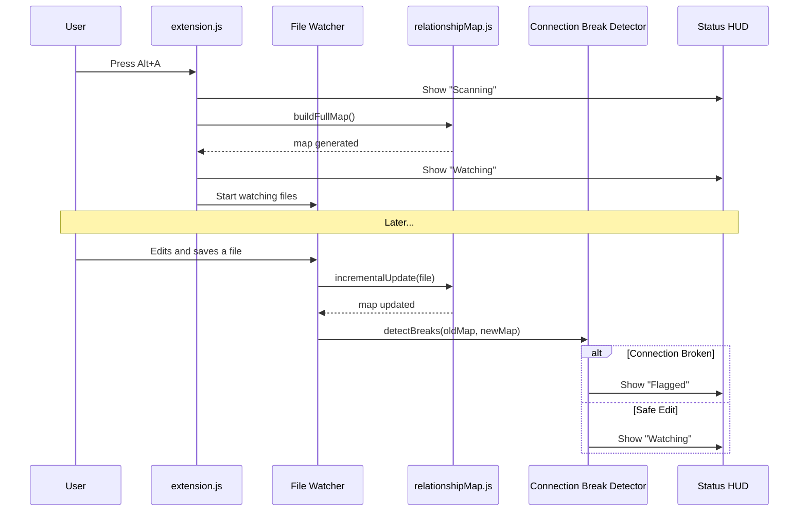

# Watchtower Architecture

Watchtower is a VS Code extension that maintains a deterministic, cross-language dependency map of your project and provides Context-Aware RAG (Retrieval-Augmented Generation) chat features powered by Mistral AI.

## High-Level System Flow



## Component Architecture



## Sequence Diagram: Passive Watching (Alt+A)



## Directory Structure

```text
watchtower/
├── docs/                     # System architecture and documentation
├── src/
│   ├── chat/                 # NLP/Chat assistant & RAG context builder
│   ├── core/                 # Storage, Constants, Watcher coordinator
│   ├── detection/            # Connection break heuristics
│   ├── hud/                  # Webview UI (Status overlay)
│   ├── log/                  # Change tracking & thrash detection
│   ├── map/                  # Full & incremental map builder
│   ├── matcher/              # Cross-language route string matching
│   ├── mistral/              # Mistral API client
│   ├── parsers/              # Plugin-based AST parsers (JS/Py)
│   └── prompt/               # Prompt refinement logic (Alt+P)
├── test/                     # Unit and Integration tests
├── test-fixtures/            # Fixtures for tests
├── scripts/                  # Utilities for installation/testing
├── archive/                  # Previous spikes and deprecated code
└── package.json              # Extension manifest
```

## Core Subsystems

### 1. AST Parsers & Plugin Architecture (`src/parsers/`)
Watchtower uses a plugin-based parsing system to extract symbols, calls, imports, and route definitions from files. Currently supported:
- **JavaScript**: Uses `acorn` and `acorn-walk`.
- **Python**: Uses `python-ast`.
- **Fallback**: Unrecognized files return a simple structure with `fallback: true`, allowing their raw paths to still be used in RAG.

### 2. The Map (`src/map/` & `src/matcher/`)
The map is a purely deterministic JSON structure (`.watchtower/relationship-map.json`) built independently of any AI. It contains:
- `connections`: Matched frontend -> backend routes.
- `sameLanguageEdges`: Call and import graphs within the same language.
- `files`: Metadata (sizeBytes, lineCount) about all scanned files for RAG.
- `symbols`: Exported functions and classes.

### 3. Connection Break Detector (`src/detection/`)
When the VS Code watcher detects a file change, the detector compares the updated map to the previous map. If a previously connected route changes its parameters or URL, a flag is emitted to the HUD.

### 4. Mistral RAG Client (`src/mistral/`)
Mistral is used **strictly** as an advisory engine. It never edits the relationship map directly.
- **Alt+C (Chat)**: Answers plain-language questions using the map and `fileContents` as context.
- **Alt+P (Prompt Refinement)**: Rewrites vague developer intentions into strict agentic prompts, explicitly warning agents not to break known connections.

### 5. Head-Up Display (HUD) (`src/hud/`)
A lightweight, non-intrusive VS Code Webview panel that stays pinned. It shows:
- Initializing
- Watching
- Broken (Flagged Connection)
- Paused
